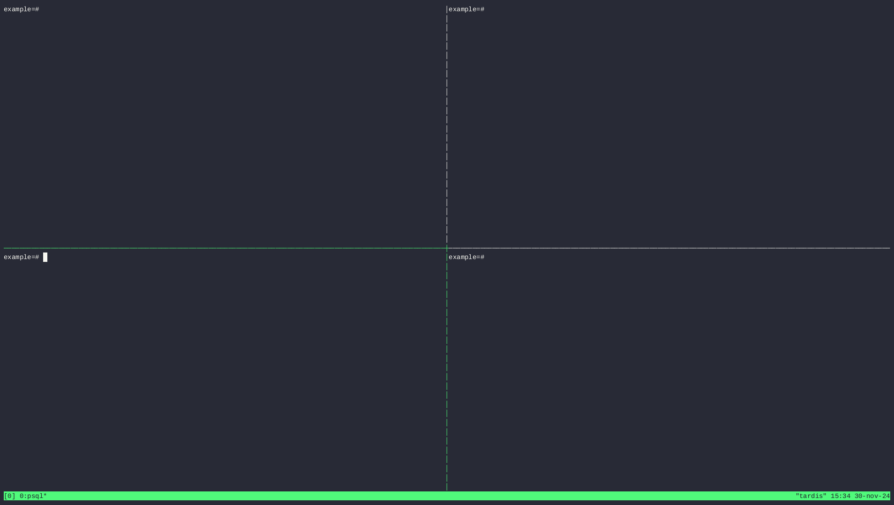
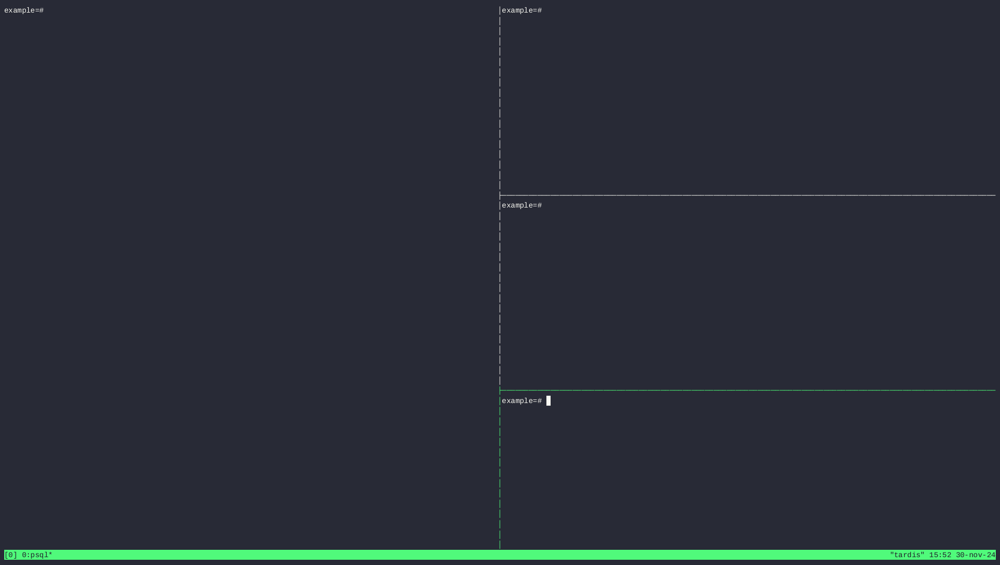

# PostgreSQL is all you need

## Example 1

CDC - Event Sourcing

## Example 2

Generating PDF

## Example 3

Do something at …

## Others ...

Thanks to:

- https://tmuxcheatsheet.com/
- https://docs.asciinema.org
